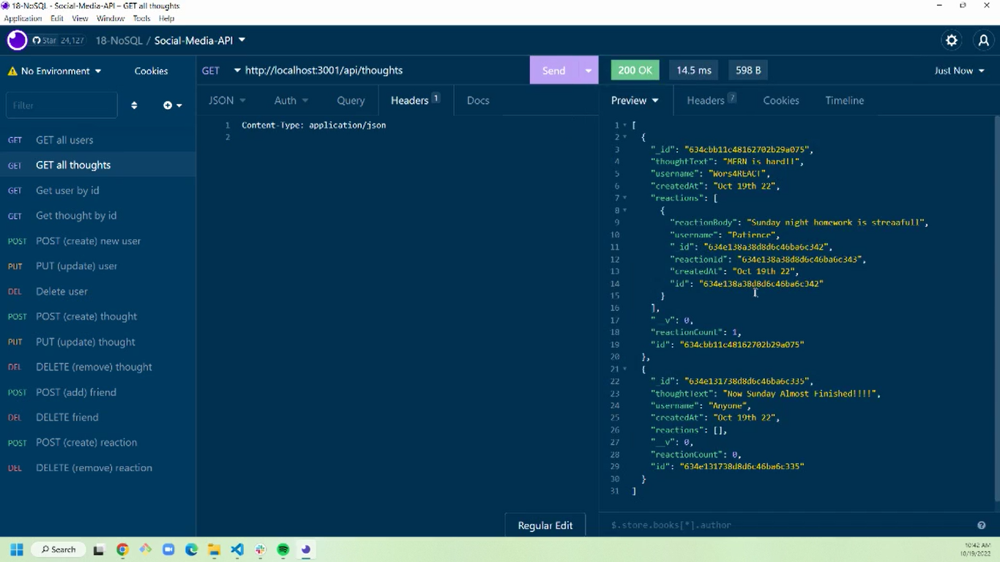
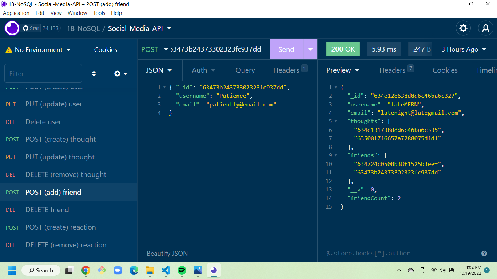

# Socia# Social Network API - NoSQL

​

## Table of Contents

- [Project description](#Description)
- [Demonstration](#Demonstration)
- [Usage](#Usage)
- [License](#License)
- [Contributing](#Contributing)
- [Questions](#Questions)

​

## Description

This application is a back-end API for a social network web application where users can share their thoughts, react to friends’ thoughts, and create a friend list.   This API uses Express.js for routing, a MongoDB database, and the Mongoose ODM. 

## Demonstration

To view walkthrough videos that demonstrate the functionality of this API, visit the
following links:

Demo #1

Demo #2

​

## Usage

       `node server.js`

## License

This project is licensed by MIT.

## Contributing

Currently, there are no guidelines for contributions to this project.

## Questions

Contact me with additional questions at
Orsha Goines at orshamarie@gmail.com or check out my work on GitHub at
[GitHub](https://github.com/OGrunner)
l-Network-API-NoSQL